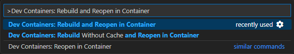

> Go to [Home](../../../README.md) | [Getting Started](../README.md)

**Table of Contents**

- [Dev Container](#dev-container)
  - [Installing the Pre-requisites](#installing-the-pre-requisites)
  - [Configuring the Visual Studio Code](#configuring-the-visual-studio-code)
  - [Cloning the Git Repository](#cloning-the-git-repository)
  - [Opening in Dev Container](#opening-in-dev-container)

### Dev Container

A dev container installation is a full-featured development environment running in a virtualized environment with its own isolated files, network, and tools.

For more information, see [Developing inside a Container](https://code.visualstudio.com/docs/devcontainers/containers) documentation from Microsoft.

#### Installing the Pre-requisites

To install the pre-requisites, click the link that corresponds to your operating system:

  - [Windows](windows.md)
  - [macOS](osx.md)
  - [Linux](linux.md)

#### Configuring the Visual Studio Code

To install the required Visual Studio Code extensions, run this command using a terminal:

```
code --install-extension ms-vscode-remote.remote-containers --force
```

To install the cosmetic Visual Studio Code extensions, run these commands using a terminal:

```
code --install-extension PKief.material-product-icons --force
```

```
code --install-extension aaron-bond.better-comments --force
```

```
code --install-extension sdras.night-owl --force
```

```
code --install-extension vscode-icons-team.vscode-icons --force
```

#### Cloning the Git Repository

To clone the remote git repository locally, run this command using a terminal:

```
git clone https://github.com/jmadoremos/amaoed-cpp-template.git --depth 1
```

If you already have the local git repository previously, run this command to get the latest copy from the remote git repository (i.e., GitHub).

```
cd amaoed-cpp-template/
```

```
git checkout master
```

```
git fetch
```

```
git pull
```

#### Opening in Dev Container

To open the local git repository in Visual Studio Code, follow these instructions:

1. Using a terminal, open this git repository in Visual Studio Code:

    ```
    code amaoed-cpp-template/
    ```

2. In Visual Studio Code, open the command pallete by pressing the keys:
     
   - **Windows:** <kbd>CTRL</kbd>+<kbd>SHIFT</kbd>+<kbd>P</kbd>
   - **OSX:** <kbd>CMD</kbd>+<kbd>SHIFT</kbd>+<kbd>P</kbd>
   - **Linux:** <kbd>CTRL</kbd>+<kbd>SHIFT</kbd>+<kbd>P</kbd>

3. In the Visual Studio Code command pallete, enter `Dev Containers: Rebuild and Reopen in Container` in the text box then press the <kbd>ENTER</kbd> key.

    

4. This may take a couple of minutes depending on your internet download speed. Wait for the entire process to complete.

5. You are now inside the dev container.

    
